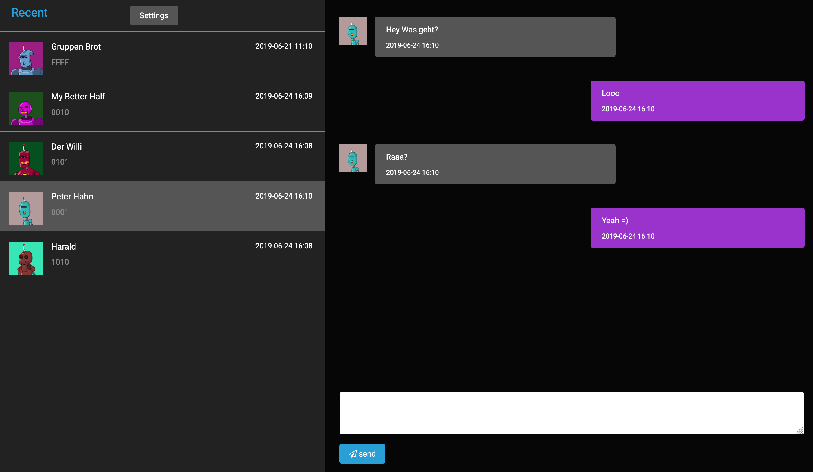

PyLoRaWebChat
=============

Echtzeitchat Server mit ein dezentrales LoRa Netz

.. image:: https://img.shields.io/badge/built%20with-Cookiecutter%20Django-ff69b4.svg
     :target: https://github.com/pydanny/cookiecutter-django/
     :alt: Built with Cookiecutter Django
.. image:: https://img.shields.io/badge/code%20style-black-000000.svg
     :target: https://github.com/ambv/black
     :alt: Black code style
.. image:: https://travis-ci.com/linuxluigi/PyLoRaWebChat.svg?branch=master
     :target: https://travis-ci.com/linuxluigi/PyLoRaWebChat
     :alt: Build Status
.. image:: https://readthedocs.org/projects/pylorawebchat/badge/?version=latest
     :target: https://pylorawebchat.readthedocs.io/en/latest/?badge=latest
     :alt: Documentation Status

:License: MIT

Quickstart
----------

.. warning:: Diese Anleitung ist für Debian / Ubuntu mit installiereten Docker und Docker-Compose geschrieben.

HIMO-01P mit den Linux Host verbinden
^^^^^^^^^^^^^^^^^^^^^^^^^^^^^^^^^^^^^

``HIMO-01P`` Modul mit den Arduino wie folgt verbinden.

+^^^^^^^^^^^^--+^^^^^^^^^-+
| Arduino      | HIMO-01P |
+^^^^^^^^^^^^--+^^^^^^^^^-+
| TX           | TX       |
+^^^^^^^^^^^^--+^^^^^^^^^-+
| RX           | RX       |
+^^^^^^^^^^^^--+^^^^^^^^^-+
| GND          | GND      |
+^^^^^^^^^^^^--+^^^^^^^^^-+
| 3.3V         | VIN      |
+^^^^^^^^^^^^--+^^^^^^^^^-+
| RESET -> GND |          |
+^^^^^^^^^^^^--+^^^^^^^^^-+

Der Arduino muss nun via USB an den Linux Host angeschlossen werden. Jetzt sollte das ``HIMO-01P`` Modul unter
den Port ``/dev/ttyACM0`` direkt ansprechbar sein.

Einstellungen
^^^^^^^^^^^^^

Um Änderungen wie die Adresse oder der ``HIMO-01P`` Einstellungen zu ändern, muss die Datei ``.envs/.local/.serial``
angepasst werden.

Software herunterladen und starten
^^^^^^^^^^^^^^^^^^^^^^^^^^^^^^^^^^

Die aktuelle Projekt Version herunterladen via Git.::

    $ git clone git@github.com:linuxluigi/PyLoRaWebChat.git
    $ cd PyLoRaWebChat

Docker Images erstellen::

    $ docker-compose -f local.yml build

Website starten::

    $ docker-compose -f local.yml up -d django  # in Background starten

Admin Benutzer erstellen::

    $ docker-compose run --rm web python manage.py createsuperuser

LoRa Daemon starten::

    $ docker-compose run --rm web python manage.py lora_daemon

Nun ist es möglich auf der Website mit dem erstellten Admin Benutzer im Backend ein zu loggen um zugriff auf die
Hauptwebsite zu erhalten. Dafür auf den Hostname des Host Systems im Browser eingeben wie ``http://localhost:8000/admin``.
Anschließend auf ``http://localhost:8000/`` gehen um den LoRa Echtzeitchat einzusetzen.

    Screenshot
