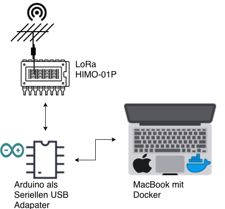
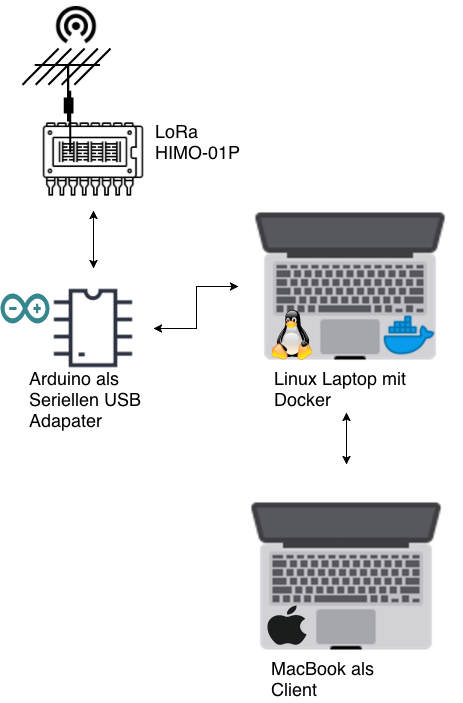
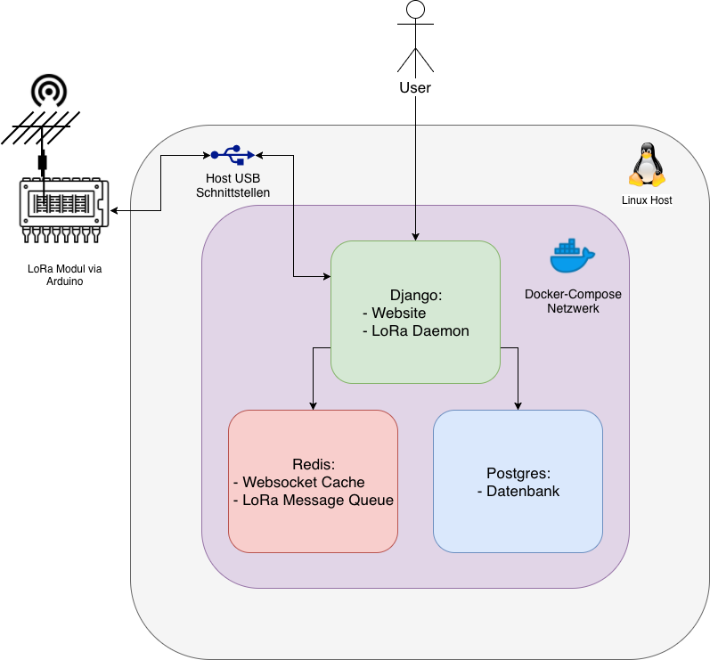
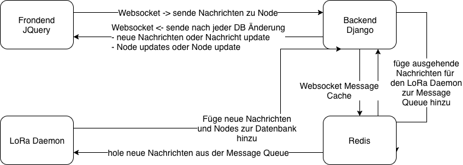

Aufbau
======

Ziel Aufbau
-----------

Um den Aufbau mit möglichst wenig Bauteilen zu erstellen, sollte das ``HIMO-01P`` Funkmodul über ein Arduino direkt an
ein MacBook angeschlossen werden. Der Arduino soll als Serielle Brücke zwischen den Host System und dem Funkmodul dienen,
siehe :numref:`Ziel_Aufbau`.

.. _Ziel_Aufbau:

    Ziel Aufbau

Als Endprodukt soll via eine Website ein Echtzeit-Chat aufgebaut werden, worüber alle Teilnehmer des Netzwerkes
automatisch aufgelistet werden und jeder Teilnehmer ein eigenen Chat Verlauf erhält.

Als Grundlage für die Website dient Django, welches in einem Docker Container gestartet werden soll, um die Anwendung
Plattformunabhänig zu gestalten. Außerdem dient Docker in diesem Fall, das System auch in Zukunft auf neuen System
auszuführen, ohne Anpassungen am Quellcode zu tätigen.

Probleme mit dem Ziel Aufbau
----------------------------

Nicht vollfunktionsfähige Arduino Nanos Kopien
^^^^^^^^^^^^^^^^^^^^^^^^^^^^^^^^^^^^^^^^^^^^^^

Nicht alle Arduino Kopien funktionieren wie vorgeschrieben, in diesen Aufbau gab es bei 2 verschiedenen Modellen
unterschiedliche Probleme:

1. Das erste Modell funktinierte die Kommunikation über den ``RX`` und ``TX`` Port nicht.
2. Bei dem zweiten Modell lieferte über den ``3.3V`` Stromausgang eine zu niedrige Spannung, wodurch das ``HIMO-01P``
   Modul nicht betrieben werden konnte.

Defekte Kabel
^^^^^^^^^^^^^

Ohne das dies am Anfang bemerkt wurde, gabe es in den ersten Versuchen defekte Kabel:

1. Ein einardriges Kabel zur Verbindung von dem Arduino mit dem ``HIMO-01P`` war gebrochen.
2. Das Micro USB Kabel, zum betreiben des Arduinos, besaß keine Leitung zur Kommunikation zwischen dem Host und dem
   Arduino. Es lieferte auschließlich Strom.

Docker USB Geräte Freigabe unter Mac
^^^^^^^^^^^^^^^^^^^^^^^^^^^^^^^^^^^^

Da für MacOS und Windows andere USB-Treiber für die Endgeräte notwendig sind als Linux, ist es nicht möglich
USB-Hardware für Docker freizugeben. Das Problem ist bei den Docker Entwickler seid Jahren bekannt, da dies aber eine
niedrige Prioität besitzt, gibt es bislang keine Offizielle Lösung.

Umgesetzter Aufbau
------------------

Um die Probleme zu lösen, wurde das Host System mit ein Ubuntu 18.04 ausgetauscht und als Arduino wird ein Arduino Uno
verwendet, siehe :numref:`Umgesetzter_Aufbau`.

.. _Umgesetzter_Aufbau:

    Umgesetzter Aufbau

Docker
------

Die Docker Container werden via einer Docker-Compose Datei verwaltet. Darin werden die Abhänigkeiten innerhalb
der Container festgelegt, auch welche Resoucen die Container von dem Host System erhalten.

Als Grundlage des Projektes wurde `cookiecutter-django`_ genommen, welches eine funktionierende Django Anwendung für
Docker erstellt.

.. _cookiecutter-django: https://github.com/pydanny/cookiecutter-django

Für diesen Aufbau werden 3 Container erstellt:

- ``django``: Enthält die Website basierend auf Django und ein Daemon zur Interaktion mit ``HIMO-01P``
- ``postgres``: Postgres Datenbank
- ``redis``: Redis Server als Cache für Websockets und als Message Queue für den ``HIMO-01P`` Daemon

In :numref:`Docker_Aufbau` wird der Aufbau grafisch Dargestellt.

.. _Docker_Aufbau:

    Docker Aufbau

Website
-------

Die Website enhält die Komponenten Frondend, Backend, Redis Cache und den LoRa Daemon für das ``HIMO-01P`` Modul.

Das Frondend Kommuniziert über Websockets direkt mit dem Django Backend, es sendet zum Server ausgehende Nachrichten
und erhält vom Backend neue bzw. update von Nachrichten und Nodes.

Für das caching von den Nachrichten nutz das Backend ein Redis Server für die Websockets & Ausgehende LoRa Nachrichten.
Sobald ein ``Node`` oder ``Message`` Objekt innerhalb der Datenbank geändert oder neu erstellt wird, sendet anschließend
das Backend diese Information zum Client via Websocket.

In :numref:`Website_Aufbau` ist die Kommunikation als Diagramm Dargestellt.

.. _Website_Aufbau:

    Website Aufbau
