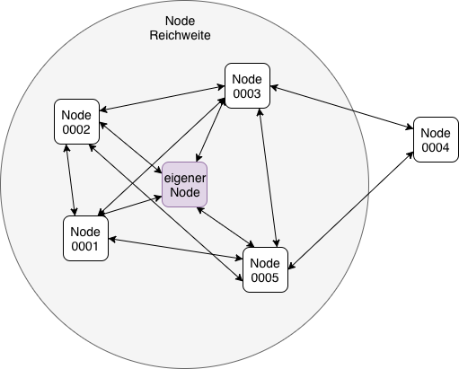

Ziel
====

Ziel war es mithilfe des LoRa Moduls ``HIMO-01P`` innherlab unserers Kurses ein eigenständiges Netzwerk aufzubauen,
wobei jeder Teilnehmer an dem Protokoll mitgewirkt hatte aber die Implementation selbst schreiben musste, siehe
:numref:`LoRa_Netzwerk`.

Als Hardware Voraussetzung wurde nur das ``HIMO-01P`` vorgegeben, ob dieses Modul mit ein Arduino, Raspberry Pi, Android
oder PC betrieben wird, war den Teilnehmer überlassen.

.. _LoRa_Netzwerk:

    LoRa Netzwerk
